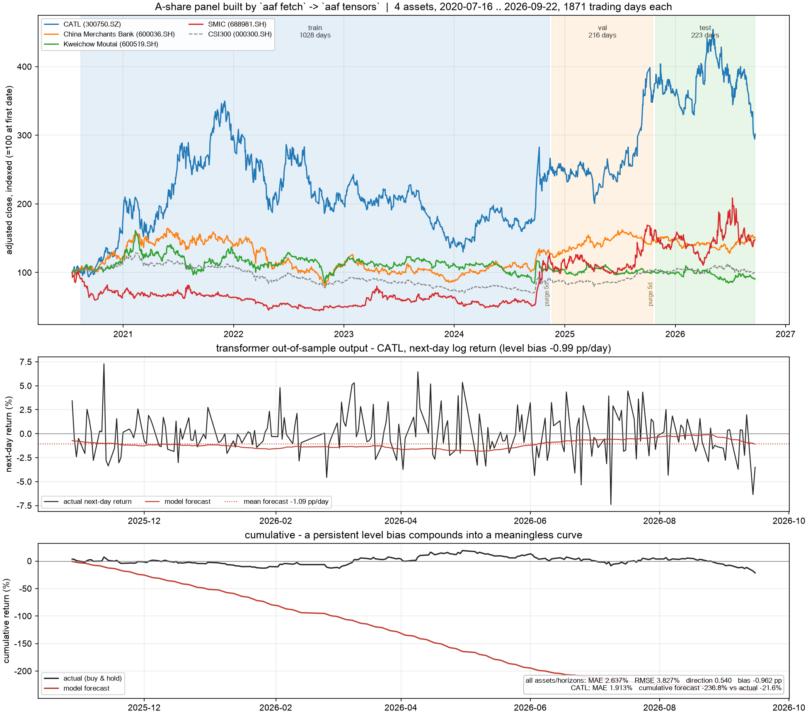

# astock-attention-forecast

Multivariate A-share forecasting end to end: a **token-less** data layer, a **self-attention**
(Transformer) multi-step forecaster, an honest baseline ladder, and an **LLM news-sentiment
overlay** that reads the last few days of headlines and filings.

Nothing here needs an API key except the optional DeepSeek overlay and the optional Tushare adapter
(this repo was built and run without a Tushare token, see [Data sources](#data-sources)).

**Headline result** — 4 assets, horizon H = 5 days, lookback L = 30 days, out-of-sample 2025-10-28 →
2026-09-22 (218 windows, cross-sector group):

* **No learned model beats a constant forecast on MAE**: `naive:zero` 2.47 %, LSTM 2.50 %, attention
  2.64 %, momentum 2.93 %. That is the expected outcome for daily returns — the loss-minimising
  estimate of the conditional mean shrinks toward zero — so MAE is reported next to direction, bias
  and per-horizon error instead of on its own.
* **Plotting the forecast caught what the metric table hid.** The first version of this model read as
  "slightly worse than naive" in the tables, when it was in fact emitting a near-constant −1.36 %/day
  for *every* asset and horizon while the training-period drift was ~0 %. The picture below is what
  exposed it; target centring plus point-initialising the output layer at the training mean fixed it
  (see [Two fixes the figure forced](#two-fixes-the-figure-forced)).
* **Direction**: a 5-seed sweep puts the attention model at 53.1 % ± 1.9 % (cross-sector) against
  LSTM 52.9 % ± 0.5 % — no separation. In the same-sector group it is 56.6 % ± 2.7 % against
  LSTM 47.7 % ± 1.4 %: a *seed-stable* gap that still has to survive the overlap and single-holdout
  caveats in [Seed sweep](#seed-sweep-are-the-results-real).
* So the deliverable is **not** "attention beats the market" — it is a pipeline plus an evaluation
  ladder honest enough to catch both its own false positives and its own broken forecasts.



*Top: the dataset `aaf fetch` → `aaf tensors` builds — forward-adjusted closes indexed to 100, with
the train / validation / test regions shaded and the 5-day purge gaps left unshaded. Middle: what the
attention model actually emits next-day on the out-of-sample period, against what happened. Bottom:
the same forecast cumulated — a level bias that reads like a rounding error per day compounds into an
obviously unusable curve.* Regenerate with `aaf chart --run reports/runs/transformer_<stamp>`.

---

## Data sources

Market data is pluggable: `config/data.yaml` declares a **priority chain** and the first usable
source wins per symbol.

| source | token | role in this repo | what it provides |
|---|---|---|---|
| [baostock](https://pypi.org/project/baostock/) | none | **primary** (all market data here) | pre-adjusted (qfq) OHLCV, amount, turnover, PE/PB, `tradestatus`; also indices |
| [akshare](https://akshare.akfamily.xyz/) | none | fallback for prices; **primary for news** | Sina daily bars; news / filings / market newswire |
| [tushare](https://tushare.pro/) | **required** | adapter present, **not exercised** (no token) | at the free 120-credit tier only unadjusted `daily` |

> The Tushare adapter is included so the pipeline can switch vendors with `--source tushare`, but it
> has **not** been run against the live API in this repo — only its unit conversion and schema
> pinning are covered by tests (`tests/test_sources.py`).

**Universe (cross-sector group)** — four different industries so a single attention budget has to
model heterogeneous regimes:

| code | name | sector |
|---|---|---|
| 600519.SH | Kweichow Moutai | Consumer staples |
| 300750.SZ | CATL | Battery |
| 600036.SH | China Merchants Bank | Bank |
| 688981.SH | SMIC | Semiconductor |
| 000300.SH | CSI300 | benchmark, used as exogenous context |

A same-sector control group (white spirit: 600519 / 000858 / 000568 / 600809) is configured as
`group: same_sector`.

### Normalization decisions that matter

* **Units**: everything is converted to CNY and shares (`baostock` already is; the Tushare adapter
  multiplies `vol × 100` and `amount × 1000`). Turnover is normalized to percent of tradable shares.
* **Adjustment**: qfq (forward-adjusted) prices, so a dividend does not look like a crash.
* **Suspensions** are dropped, not filled. Baostock reports a halted day with empty
  `volume/amount/turn`; SMIC has six such days (2025-09-01 → 2025-09-08). The panel builder keeps a
  date only when **every** symbol actually traded (`tradestatus == 1`), so the model never sees a
  fabricated zero-volume day. When a symbol lists later (SMIC: 2020-07-16), the intersection alignment
  drops the earlier dates and reports how many.
* **Provenance**: every cached panel is written with a `*.meta.json` recording the requested range,
  the vendor that served each symbol, the row count and the actual first/last date.

---

## Dataset format

`aaf tensors` turns the long panel into arrays plus a sidecar of split bookkeeping:

```
x : (1477, 4, 12)      # timesteps x assets x features  (z-scored on the training slice only)
y : (1477, 4, 5)       # forward log returns, y[t, n, h-1] = log(close[t+h] / close[t])
dates: 2020-08-13 .. 2026-09-22   (1477 trading days)
```

Sliding windows for the model are `(S, L, N, F) = (999, 30, 4, 12)` train / `(216, …)` val /
`(218, …)` test.

Features (12 channels): `log_return`, `intraday_range`, `log_volume`, `log_amount`, `turn`,
`mom_5`, `mom_20`, `vol_20`, plus benchmark context `bench_return` and relative strength
`rel_log_return`, `rel_mom_5`, `rel_mom_20`.

**Split hygiene** — chronological 70/15/15 with a **purge gap of H = 5 steps** between train and
validation and between validation and test, so no training window's 5-day target can reach into the
next split. Standardization statistics come from the training slice alone; the test rows keep their
real scale. Both properties are asserted in `tests/test_features.py`.

---

## Model

`AttentionForecaster` (`src/astock_af/models/attention.py`):

1. each **timestep is a token** carrying all assets' standardized features (`N×F → d_model`), plus a
   learned positional embedding — so self-attention mixes information across assets in the
   representation;
2. a 2-layer Transformer encoder (`d_model=64`, 4 heads, pre-norm, GELU) produces one memory vector
   per past day;
3. **`N × H` learned queries cross-attend** onto that memory. Each query owns one (asset, horizon)
   pair, and the returned attention map answers *"which past days drove this asset's h-step-ahead
   forecast"* — the model is auditable instead of a black box.

Baselines, scored on identical splits: `lstm`, `linear` (flattened window → linear head), `var`
(ridge vector-autoregression on 5 lags of all assets' returns), and three no-fit references
`naive:zero`, `naive:mean`, `naive:momentum`. The attention weights are also stored per test sample
(`attention.npz`); note they are only meaningful from an `eval()` forward pass, because dropout
perturbs attention weights during training (asserted by a test).

### Two fixes the figure forced

Forecasting daily returns has an awkward property: the trivial predictor (predict ~0) is a strong
baseline, and a randomly initialised network is *far* from it. Two mechanisms in `train.py` now exist
only because plotting the output exposed them:

1. **Target centring.** The network predicts the deviation from the training-period per-(asset,
   horizon) mean, which is added back at inference. Without it the level itself has to be discovered
   by gradient descent, and early stopping happily keeps a snapshot that is worse than predicting the
   mean (observed: val MSE 14.5 vs 11.6 for predicting zero, and a level bias of −1.36 pp/day).
2. **Point-initialising the output layer.** Every torch model has its output weights zeroed after
   construction, so training *starts exactly at* `naive:mean` (zero in the centred space). The best
   validation snapshot can therefore never be worse than that baseline by more than the first epoch's
   damage: the cross-sector attention model now stops at val MSE 12.12 against 11.45 for the trivial
   forecast. `naive:mean` is the number to beat, and nothing here beats it.

Both are asserted by tests (`tests/test_models.py::test_point_initialisation_starts_at_the_trivial_forecast`).
They cut the attention model's level bias from −1.83 pp/day to −0.96 pp/day and its test MAE from
4.07 % to 2.64 %, and they changed the direction result from "below chance in one group" to a
seed-stable ordering in the other — see [Seed sweep](#seed-sweep-are-the-results-real). A residual
negative drift of −0.96 pp/day remains; it is honest but not tradable, and it is listed under
[Known limitations](#known-limitations).

Train with `aaf benchmark`, which writes one run directory per model under `reports/runs/` containing
`metrics.json`, `history.json`, `predictions.npz`, `model.pt` and a three-panel `report.png`
(prediction vs actual, MAE by horizon, attention heatmap).

---

## Results

Cross-sector group, test window 2025-10-28 → 2026-09-22 (218 samples), MPS on an M5 Pro:

| model | epochs | sec | val MSE | MAE % | RMSE % | direction acc | bias % | MAE h1 | h5 |
|---|---|---|---|---|---|---|---|---|---|
| naive:zero | – | 0.0 | 11.56 | **2.471** | **3.654** | 0.003 * | +0.12 | 1.49 | 3.36 |
| naive:mean | – | 0.0 | 11.45 | 2.486 | 3.668 | 0.456 | +0.26 | 1.50 | 3.39 |
| lstm | 27 | 2.2 | 11.93 | 2.503 | 3.727 | 0.531 | −0.02 | 1.57 | 3.36 |
| var | – | 0.0 | 12.01 | 2.529 | 3.726 | 0.501 | +0.27 | 1.52 | 3.45 |
| **transformer (self-attention)** | 26 | 4.1 | 12.12 | 2.637 | 3.827 | **0.540** | −0.96 | 1.80 | 3.43 |
| naive:momentum | – | 0.0 | 16.33 | 2.925 | 4.324 | 0.503 | +0.08 | 2.21 | 3.62 |
| linear | 34 | 0.7 | 22.47 | 4.317 | 5.785 | 0.537 | −1.15 | 2.84 | 5.56 |

Rows are sorted by MAE. `naive:mean`'s val MSE is exactly what a point-initialised model starts at,
so the gap to it is what training actually bought — in this window, nothing.

\* A constant-zero forecast makes no directional call, so `sign(pred) == sign(true)` is false by
construction; read it as "n/a", not as 0.3 % skill.

Per-asset breakdown for the attention model — MAE tracks each name's volatility, and the directional
edge is concentrated in the two large-cap names:

| asset | MAE % | RMSE % | direction acc |
|---|---|---|---|
| Kweichow Moutai | 1.804 | 2.559 | **0.580** |
| China Merchants Bank | 1.704 | 2.085 | 0.501 |
| CATL | 2.806 | 3.753 | 0.556 |
| SMIC | 4.233 | 5.796 | 0.525 |

MAE tracks each name's volatility (SMIC is the most volatile, and the hardest). The directional edge
is spread across three of the four names rather than concentrated in one — which is the opposite of
what the pre-fix version of this table showed, when it was one lucky name and one below-chance name.

Run artefacts: [`reports/benchmark.md`](reports/benchmark.md) (generated), one
`report.png` per model under `reports/runs/`.

### How to read this

* **MAE is a shrinkage metric.** Predicting 0 % every day wins, because daily log returns have a mean
  near zero and a large noise term. Any honest daily-return benchmark has to show this; a repo that
  reports only MAE will accidentally "prove" that a naive constant beats every model.
* **The attention model's directional edge is real *within this holdout* but the holdout is one
  period.** The same-sector 5-seed sweep separates it from the LSTM (56.6 % ± 2.7 % vs 47.7 % ± 1.4 %),
  which rules out initialisation luck — it does not rule out that the window itself was kind. Only a
  walk-forward design speaks to that.
* **Overlapping 5-day targets shrink the effective sample.** 274 test windows with H = 5 overlap, so
  the independent-block count is closer to 55; at that size a 56.6 % hit rate is ~1σ from chance.
  Read the seed sweep as "the ordering is not noise", never as "the edge is proven".
* **The forecast still carries a −0.96 pp/day level bias**, so it is not tradable as-is even where its
  ranking is informative (see [Known limitations](#known-limitations)).
* **Rolling-origin evaluation would be stronger.** The current split is a single chronological
  holdout. A walk-forward loop (retrain monthly) is the natural next step and is not implemented.

### Same-sector control group

The white-spirit group (Moutai, Wuliangye, Luzhou Laojiao, Shanxi Fenjiu) has a longer history — all
four listed before 2019 — so its panel starts 2019-01-02 and the chronological split lands on a
different test window (2025-08-01 → 2026-09-22, 274 windows). The two groups are therefore **not**
strictly comparable; treat this as a second, independent look rather than a controlled A/B test.

| model | epochs | sec | val MSE | MAE % | RMSE % | direction acc | MAE h1 | h5 |
|---|---|---|---|---|---|---|---|---|
| **transformer (self-attention)** | 26 | 4.8 | 17.45 | **2.003** | 2.758 | **0.535** | 1.18 | 2.71 |
| naive:zero | – | 0.0 | 17.06 | 2.016 | **2.743** | 0.002 * | 1.18 | 2.73 |
| naive:mean | – | 0.0 | 17.24 | 2.081 | 2.807 | 0.395 | 1.20 | 2.85 |
| lstm | 27 | 2.6 | 17.64 | 2.085 | 2.824 | 0.509 | 1.19 | 2.87 |
| var | – | 0.0 | 17.05 | 2.091 | 2.830 | 0.434 | 1.20 | 2.85 |
| naive:momentum | – | 0.0 | 19.36 | 2.397 | 3.249 | 0.515 | 1.78 | 3.00 |
| linear | 124 | 3.0 | 26.59 | 3.127 | 4.203 | 0.472 | 1.69 | 4.40 |

Here the attention model leads on **both** MAE (2.003 % vs 2.016 % for `naive:zero`) and direction
(53.5 %) — the only cell in either group where a learned model tops the MAE table, and the opposite
ranking from the cross-sector group. The margin over `naive:zero` is 0.013 pp, far inside the
±0.034 pp seed spread measured below, so the MAE "win" means nothing; the directional gap is the part
that survives reseeding. Note also that the attention model's *validation* loss (17.45) is worse than
`naive:mean` (17.24) while its test direction is better: the two criteria disagree, which is exactly
where a single reported number turns into a misleading claim.

---

## Seed sweep: are the results real?

A single split with a single seed cannot separate skill from initialisation. `scripts/seed_sweep.py`
retrains the attention model and its LSTM baseline across 5 seeds on both groups:

| group | model | runs | direction acc (mean ± std) | MAE % (mean ± std) | RMSE % |
|---|---|---|---|---|---|
| cross_sector | transformer (self-attention) | 5 | 0.531 ± 0.019 | 2.649 ± 0.121 | 3.822 |
| cross_sector | lstm | 5 | 0.529 ± 0.005 | 2.547 ± 0.042 | 3.727 |
| same_sector | transformer (self-attention) | 5 | **0.566 ± 0.027** | 2.048 ± 0.034 | 2.826 |
| same_sector | lstm | 5 | 0.477 ± 0.014 | 2.149 ± 0.052 | 2.878 |

Reading:

* **cross-sector: no separation.** +0.2 pp for the attention model against a ±1.9 pp seed spread, and
  the LSTM is better on MAE (2.547 vs 2.649). Whatever the single-split 54.0 % suggested, reseeding
  does not reproduce it.
* **same-sector: an 8.9 pp gap that reseeding does not remove** — 56.6 % ± 2.7 % against
  47.7 % ± 1.4 %, Welch's t over the 5 + 5 runs gives t ≈ 6.6. The same models order the *other* way
  in cross-sector, so this is group-specific rather than a general property of the architecture.
* **the pre-fix version of this table said the opposite** (same-sector attention at 48.7 % ± 5.7 %,
  below chance). That was an artifact of the level bias described in
  [Two fixes the figure forced](#two-fixes-the-figure-forced), not of the architecture — which is why
  the fix is documented here instead of being applied silently.
* **what reseeding does not cover**: one holdout period, overlapping targets (~55 independent 5-day
  blocks out of 274 windows), and one hyperparameter setting per model.

**Conclusion: no MAE win for self-attention anywhere; a seed-stable directional ordering in the
same-sector group, on a single holdout, that a walk-forward run would have to confirm.** The
deliverable is the pipeline, the leakage-safe evaluation, and the two diagnostics — seed sweep and
plotted forecast — that caught this project's own false positive and its own broken model.

---

## LLM overlay

`aaf llm` asks a large language model (DeepSeek `deepseek-chat`, temperature 0.2, JSON mode) for a
5-day directional view per asset, grounded in:

* the symbol's recent price action (last 10 sessions, 20/60-day returns, realised volatility);
* company news (Eastmoney search API, 8–10 items);
* exchange filings for the last few days;
* market-wide newswire (CLS telegraph) plus the CCTV broadcast (policy context).

The answer is compared against the attention model's live forecast for the same date. Real output
from 2026-09-22:

| asset | LLM view | conf. | expected % | model h1 | agree |
|---|---|---|---|---|---|
| 600519.SH | down | 0.55 | −1.20 | down (−1.36 %) | yes |
| 300750.SZ | up | 0.55 | +2.50 | down (−1.26 %) | no |
| 600036.SH | flat | 0.55 | +0.20 | down (−1.34 %) | no |
| 688981.SH | up | 0.55 | +1.50 | down (−1.30 %) | no |

**Read the `agree` column with the bias in mind.** The model answers *down* for all four names,
because of the −0.96 pp/day level bias documented above; so `agree` mostly reduces to "the LLM also
said down". Printing it anyway is the point: a directional overlay only means something once the
forecast's level has been removed, which is not implemented yet.

The reasoning is grounded in retrievable facts, e.g. for CATL: *"repurchased ~3.69m shares for
RMB1.1bn on 9/21, ~1.51m for RMB456m on 9/18 … execution prices cluster at RMB296–307"*, and for
Moutai: *"2026 interim report showed net profit down 1.95 % YoY"*. Full responses, drivers and risks:
[`reports/llm_overlay.md`](reports/llm_overlay.md); raw headlines: `reports/llm_overlay.news.json`.

**Honest limits.** The free news endpoints only serve *recent* items — there is no archive to replay
last quarter's headlines — so the overlay is **forward-looking and cannot be backtested**. Instead,
every call is persisted with its `as_of` date and `score_previous()` grades it automatically once its
horizon has elapsed, so a track record accumulates across runs rather than being asserted. On a first
run the report says so explicitly: *"no earlier calls with an elapsed horizon yet"*.

Implementation note worth knowing: `akshare.stock_news_em` breaks on pandas 3.x
(`ArrowInvalid: invalid escape sequence: \u`) because string columns are PyArrow-backed and RE2
rejects `\u` escapes, so the overlay fetches Eastmoney over HTTP directly and keeps akshare as a
fallback.

---

## Forward forecast (the days that have not happened yet)

`aaf forecast --run reports/runs/transformer_<stamp>` runs the trained model on the **last window in
the panel** and prints a genuine forward view: `N` assets × `H` trading days ahead, with the target
dates taken from the exchange calendar rather than guessed. Output for the 2026-09-22 close:

```
Target trading days: 2026-09-23, 2026-09-24, 2026-09-28, 2026-09-29, 2026-09-30
                     (exchange calendar (akshare/sina))
```

(the calendar correctly skips 2026-09-25, the Mid-Autumn holiday — a weekday-fallback would have
invented a trading day there.)

**Raw model output** — forward log return in %:

| asset | t+1 | t+2 | t+3 | t+4 | t+5 |
|---|---|---|---|---|---|
| CATL (300750.SZ) | −1.26 | −1.16 | −1.06 | −0.97 | −0.88 |
| China Merchants Bank (600036.SH) | −1.34 | −1.32 | −1.30 | −1.28 | −1.26 |
| Kweichow Moutai (600519.SH) | −1.36 | −1.35 | −1.35 | −1.34 | −1.34 |
| SMIC (688981.SH) | −1.30 | −1.24 | −1.18 | −1.12 | −1.06 |

**Bias-corrected** — the same minus a bias estimated on the *validation* slice (which precedes the
as-of date, so this is not look-ahead):

| asset | t+1 | t+2 | t+3 | t+4 | t+5 |
|---|---|---|---|---|---|
| CATL (300750.SZ) | −0.74 | −0.48 | −0.21 | +0.08 | +0.36 |
| China Merchants Bank (600036.SH) | −0.92 | −0.83 | −0.73 | −0.63 | −0.52 |
| Kweichow Moutai (600519.SH) | −1.01 | −1.02 | −1.02 | −1.02 | −1.02 |
| SMIC (688981.SH) | −0.81 | −0.61 | −0.40 | −0.15 | +0.12 |

Three honest readings:

* **the raw output is not usable as-is.** Every name and horizon says ≈ −1.3 %, which is the residual
  level bias, not information: the cross-sectional spread at t+1 is 0.10 pp.
* **the correction does not fully remove the bias**, because it is estimated on a period that was
  itself biased differently: validation bias −0.65 pp overall against −0.96 pp on the test window, so
  the corrected forecast still sits about −0.32 pp low. The per-horizon *shape* of the bias is
  informative though — flat for Moutai (−0.34 → −0.32, a pure level error) but growing for CATL
  (−0.52 → −1.24, a persistent drift the model believes in).
* **what is left is a relative view**: after correction CATL and SMIC turn positive by t+4/t+5 while
  Moutai stays flat-negative and CMB stays negative. That is the shape of the model's opinion, and it
  is the only part of this table worth arguing with.

Full tables: [`reports/forecast.md`](reports/forecast.md), regenerated on every run. Because each
forecast is dated and persisted, `score_previous()` grades it automatically once its horizon elapses —
so this section is meant to become a track record, and currently says *"no earlier calls with an
elapsed horizon yet"*.

---

## Reproduce

```bash
uv venv .venv --python 3.12 && uv pip install --python .venv -e .

source .venv/bin/activate
aaf sources                       # which vendors are usable right now
aaf fetch                         # baostock panel -> data/cache/panel.parquet (+ meta.json)
aaf tensors                       # panel -> data/cache/tensors.npz
aaf benchmark --epochs=150        # all models, same splits -> reports/benchmark.md + per-run PNGs
aaf evaluate --run reports/runs/transformer_<stamp>     # metrics + attention profile
aaf chart --run reports/runs/transformer_<stamp>        # README figure -> reports/figures/price_panel.png
aaf forecast --run reports/runs/transformer_<stamp>     # next H trading days -> reports/forecast.md
aaf llm --run reports/runs/transformer_<stamp>          # DeepSeek news overlay
aaf fetch --group=same_sector --name=panel_same         # white-spirit control group
aaf tensors --name=panel_same --out=data/cache/tensors_same.npz
aaf benchmark --tensors_path=data/cache/tensors_same.npz --out_dir=reports/runs/same_sector \
              --report=reports/benchmark_same_sector.md
python scripts/seed_sweep.py --seeds=5 --epochs=150      # mean +/- std across seeds
pytest -q                         # 46 tests, no network required
```

`config/data.yaml` (universe, vendors, alignment), `config/dataset.yaml` (L, H, features, split
ratios), `config/model.yaml` (architecture + optimiser), `config/llm.yaml` (model, horizon, prompt
budget).

## Layout

```
src/astock_af/
  config.py              typed YAML config (dataclasses)
  cli.py                 fire CLI: sources | fetch | coverage | tensors | train | benchmark | evaluate | chart | forecast | llm
  data/symbols.py        symbol parsing, vendor-specific rendering, ambiguity guard
  data/sources.py        baostock / akshare / tushare adapters, one canonical schema
  data/panel.py          fetch chain, alignment, caching, provenance, coverage report
  data/features.py       feature frame -> (T, N, F) tensor + targets, split bookkeeping
  models/attention.py    the self-attention forecaster
  models/baselines.py    linear / LSTM / ridge-VAR / naive references
  models/dataset.py      windowing, purge-aware splits, torch loaders
  train.py               training loop, early stopping, run artefacts
  evaluate.py            metric tables, benchmark aggregation, attention summary, plots
  forecast.py            next-H-days forward view + validation-slice bias correction
  llm/news.py            news + filings + market newswire collectors
  llm/client.py          OpenAI-compatible chat client (JSON mode, retries)
  llm/overlay.py         prompt assembly, model-vs-LLM comparison, self-scoring
scripts/seed_sweep.py    seed-variance check: is the directional edge real?
reports/figures/         committed README figure (regenerate with `aaf chart`)
reports/{benchmark,benchmark_same_sector,seed_sweep,llm_overlay,forecast}.md   generated evidence
```

## Known limitations

* Daily-return forecasting is close to a noise floor: report direction and calibration, not just MAE,
  and reseed before believing any of it.
* The attention model still carries a **−0.96 pp/day level bias** on the cross-sector test window.
  Early stopping picks the least-bad deviation from the trivial forecast, and for this data every
  deviation was worse than standing still. Removing the level (or fitting it separately from the shape)
  is not implemented, so the forecast is not tradable even where its ranking is informative.
* One chronological holdout; no walk-forward retraining, no transaction costs, no position sizing.
* The forward forecast (`aaf forecast`) still carries a residual level bias of roughly 0.3 pp/day after
  validation-slice correction, so it is a *relative* view across names, not an expected return.
* The two asset groups cover different test periods, so cross-group comparison is indicative only.
* The LLM overlay is a single call per asset with no self-consistency check, and its numeric
  `expected_return_pct` should be read as a coarse sentiment score, not a forecast.
* The Tushare adapter is untested against the live API here (no token).
* `akshare`'s Eastmoney price endpoints (push2his) were rejected from this network, which is why the
  Sina endpoints are used for prices.
